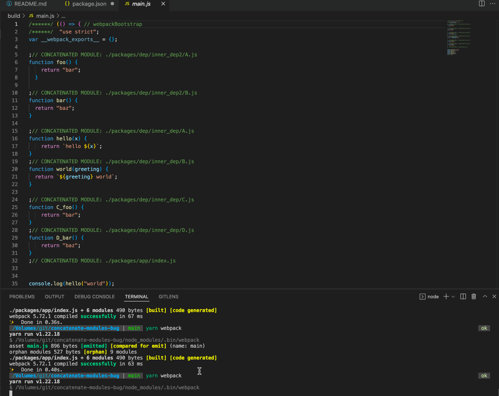

# Webpack bug with `optimization.concatenateModules`

More info here: https://github.com/webpack/webpack/discussions/15844

It seems that something about this style of re-exporting causes issues with webpack's concatenated module ordering. In `dep/inner_dep` and `dep/inner_dep2` we `export *` from each module in `index.js`, and then in `dep/index.js`, we `import *` and then re-export those imports. That seems to cause issues with concatenated module ordering in webpack.

You might need to run the build many times to get the different output, but if you keep running `yarn webpack` over and over, you'll eventually get a different output in `build/main.js`. You can see the difference between `build_output1` and `build_output2`.

